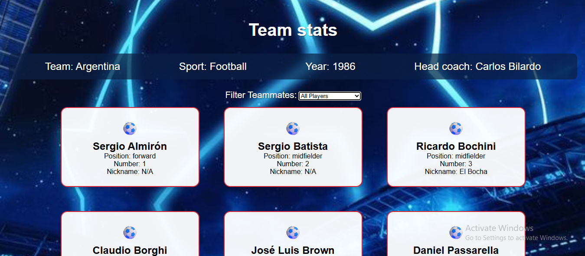

# ⚽ Football Team Cards

An interactive web application that showcases a football team's roster with stylish player cards and filtering features.  
Built with **HTML, CSS, and modern JavaScript** as part of my #100DaysOfCode challenge.  

---

## 📖 Overview
The **Football Team Cards** project displays a team roster with player cards that include details like **name, position, jersey number, and nickname**.  
It also features **filtering functionality** so users can easily sort players by position, nickname, or see the full roster.  

This project combines **array methods (map, filter)** with **DOM manipulation** to dynamically render player cards. The design uses a football-inspired theme to create an immersive and fun experience.  

---

## ✨ Features

### 🃏 Dynamic Player Cards
- Displays players in styled cards.  
- Each card shows:  
  - Player Name (with **“(Captain)”** if applicable)  
  - Position  
  - Jersey Number  
  - Nickname (if available)  
- Clean modern design with **dark navy background**, **crimson red accents**, and **white text**.  
- Hover effects + ⚽ emoji for visual appeal.  

### 🎛️ Filtering Functionality
- Dropdown filter to display:  
  - All Players  
  - Players with Nicknames  
  - By Position → **Forward, Midfielder, Defender, Goalkeeper**  
- Built using **JavaScript’s `filter()` method** for dynamic updates.  

### 📱 Responsive Design
- Works seamlessly on **desktop & mobile**.  
- On smaller screens:  
  - Team stats stack vertically  
  - Player cards resize for readability.  

### 📊 Team Stats Section
- Displays: Team Name, Sport, Year, Head Coach.  
- Styled with **semi-transparent background** for clarity.  

---

## 🛠️ Tech Stack
- **HTML5** – Semantic structure  
- **CSS3** – Theming, responsiveness, hover effects  
- **JavaScript (ES6+)** – DOM manipulation, `map()`, `filter()`, event handling  

---
## 🚀 Live Demo
🔗 [Live Demo]([https://footballteamcard1.netlify.app/])  

---

## 💻 GitHub Repository
🔗 [GitHub Repo]([https://github.com/kal1kidan/FootballTeamCard])

---
## 📸 Sneak Peek
  

---

## 📚 What I Learned
- Practicing **array methods (`map()`, `filter()`)** to handle data dynamically.  
- Creating reusable functions for rendering UI.  
- Building responsive designs for real-world apps.  
- Blending **functionality + themed design** for a fun user experience.  

---

## 🙌 Purpose
This project helped me strengthen my understanding of **modern JavaScript methods, DOM manipulation, and responsive CSS**  while keeping the experience engaging for football fans!  

